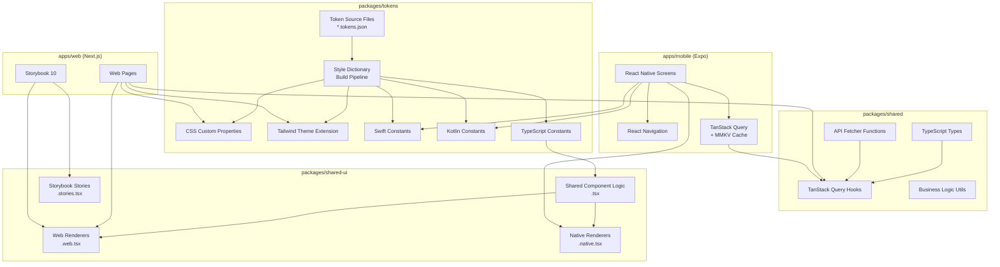

# Data Model: Cross-Platform Hot-Reloadable UI System

**Feature Branch**: `008-cross-platform-ui`  
**Created**: 2026-03-17  
**Status**: Complete

> **Note**: This spec introduces no new database tables. The data model focuses on
> design token schemas, component registry schemas, and configuration structures
> that define the cross-platform UI system.

---

## Design Token Schema

### W3C DTCG Token Format

All tokens use the [W3C Design Tokens Community Group](https://design-tokens.github.io/community-group/format/) format. Source files live in `packages/tokens/src/`.

#### Token File Structure

```
packages/tokens/
├── src/
│   ├── color.tokens.json       # Colour tokens (brand, semantic, surface)
│   ├── spacing.tokens.json     # Spacing scale
│   ├── typography.tokens.json  # Font families, sizes, weights, line-heights
│   ├── shadow.tokens.json      # Elevation / box-shadow definitions
│   ├── radius.tokens.json      # Border radius scale
│   └── global.tokens.json      # Composite / reference tokens
├── build/                      # Generated outputs (gitignored)
│   ├── css/
│   │   └── tokens.css          # CSS custom properties
│   ├── tailwind/
│   │   └── tokens.ts           # Tailwind CSS 4 theme extension
│   ├── swift/
│   │   └── DesignTokens.swift  # iOS Swift constants
│   ├── kotlin/
│   │   └── DesignTokens.kt     # Android Kotlin constants
│   └── ts/
│       └── tokens.ts           # TypeScript constants (shared logic)
├── config.ts                   # Style Dictionary v4 config
└── package.json
```

### Token Categories & Schema

#### Colour Tokens — `color.tokens.json`

```json
{
  "color": {
    "brand": {
      "primary": {
        "$value": "#6366F1",
        "$type": "color",
        "$description": "Primary interactive colour — buttons, links, focus rings"
      },
      "primary-hover": {
        "$value": "#4F46E5",
        "$type": "color"
      },
      "secondary": {
        "$value": "#EC4899",
        "$type": "color",
        "$description": "Accent colour — badges, highlights, hover states"
      }
    },
    "semantic": {
      "success": { "$value": "#10B981", "$type": "color" },
      "warning": { "$value": "#F59E0B", "$type": "color" },
      "error":   { "$value": "#EF4444", "$type": "color" },
      "info":    { "$value": "#3B82F6", "$type": "color" }
    },
    "surface": {
      "background":    { "$value": "#FFFFFF", "$type": "color" },
      "foreground":    { "$value": "#111827", "$type": "color" },
      "muted":         { "$value": "#F3F4F6", "$type": "color" },
      "muted-foreground": { "$value": "#6B7280", "$type": "color" },
      "border":        { "$value": "#E5E7EB", "$type": "color" },
      "card":          { "$value": "#FFFFFF", "$type": "color" },
      "card-foreground": { "$value": "#111827", "$type": "color" }
    },
    "dark": {
      "surface": {
        "background":    { "$value": "#111827", "$type": "color" },
        "foreground":    { "$value": "#F9FAFB", "$type": "color" },
        "muted":         { "$value": "#1F2937", "$type": "color" },
        "muted-foreground": { "$value": "#9CA3AF", "$type": "color" },
        "border":        { "$value": "#374151", "$type": "color" },
        "card":          { "$value": "#1F2937", "$type": "color" },
        "card-foreground": { "$value": "#F9FAFB", "$type": "color" }
      }
    }
  }
}
```

#### Spacing Tokens — `spacing.tokens.json`

```json
{
  "spacing": {
    "0":   { "$value": "0px",  "$type": "dimension" },
    "1":   { "$value": "4px",  "$type": "dimension" },
    "2":   { "$value": "8px",  "$type": "dimension" },
    "3":   { "$value": "12px", "$type": "dimension" },
    "4":   { "$value": "16px", "$type": "dimension" },
    "5":   { "$value": "20px", "$type": "dimension" },
    "6":   { "$value": "24px", "$type": "dimension" },
    "8":   { "$value": "32px", "$type": "dimension" },
    "10":  { "$value": "40px", "$type": "dimension" },
    "12":  { "$value": "48px", "$type": "dimension" },
    "16":  { "$value": "64px", "$type": "dimension" },
    "20":  { "$value": "80px", "$type": "dimension" },
    "24":  { "$value": "96px", "$type": "dimension" }
  }
}
```

#### Typography Tokens — `typography.tokens.json`

```json
{
  "font": {
    "family": {
      "sans":  { "$value": "Inter, system-ui, sans-serif", "$type": "fontFamily" },
      "mono":  { "$value": "JetBrains Mono, monospace", "$type": "fontFamily" }
    },
    "size": {
      "xs":   { "$value": "12px", "$type": "dimension" },
      "sm":   { "$value": "14px", "$type": "dimension" },
      "base": { "$value": "16px", "$type": "dimension" },
      "lg":   { "$value": "18px", "$type": "dimension" },
      "xl":   { "$value": "20px", "$type": "dimension" },
      "2xl":  { "$value": "24px", "$type": "dimension" },
      "3xl":  { "$value": "30px", "$type": "dimension" },
      "4xl":  { "$value": "36px", "$type": "dimension" }
    },
    "weight": {
      "normal":   { "$value": "400", "$type": "fontWeight" },
      "medium":   { "$value": "500", "$type": "fontWeight" },
      "semibold": { "$value": "600", "$type": "fontWeight" },
      "bold":     { "$value": "700", "$type": "fontWeight" }
    },
    "line-height": {
      "tight":  { "$value": "1.25", "$type": "number" },
      "normal": { "$value": "1.5",  "$type": "number" },
      "loose":  { "$value": "1.75", "$type": "number" }
    }
  }
}
```

#### Shadow Tokens — `shadow.tokens.json`

```json
{
  "shadow": {
    "sm":  { "$value": "0 1px 2px 0 rgba(0,0,0,0.05)",  "$type": "shadow" },
    "md":  { "$value": "0 4px 6px -1px rgba(0,0,0,0.1)", "$type": "shadow" },
    "lg":  { "$value": "0 10px 15px -3px rgba(0,0,0,0.1)", "$type": "shadow" },
    "xl":  { "$value": "0 20px 25px -5px rgba(0,0,0,0.1)", "$type": "shadow" }
  }
}
```

#### Radius Tokens — `radius.tokens.json`

```json
{
  "radius": {
    "none": { "$value": "0px",    "$type": "dimension" },
    "sm":   { "$value": "4px",    "$type": "dimension" },
    "md":   { "$value": "8px",    "$type": "dimension" },
    "lg":   { "$value": "12px",   "$type": "dimension" },
    "xl":   { "$value": "16px",   "$type": "dimension" },
    "full": { "$value": "9999px", "$type": "dimension" }
  }
}
```

### Token Naming Convention

Pattern: `{category}-{group}-{variant}`

| Example | Category | Group | Variant |
|---------|----------|-------|---------|
| `color-brand-primary` | color | brand | primary |
| `color-brand-primary-hover` | color | brand | primary-hover |
| `spacing-4` | spacing | — | 4 |
| `font-size-lg` | font | size | lg |
| `shadow-md` | shadow | — | md |
| `radius-lg` | radius | — | lg |

### Platform Output Mapping

| Source | Web CSS | Tailwind | Swift | Kotlin | TypeScript |
|--------|---------|----------|-------|--------|------------|
| `color.brand.primary.$value` | `--color-brand-primary: #6366F1` | `theme.colors.brand.primary` | `DesignTokens.Color.Brand.primary` | `DesignTokens.Color.Brand.PRIMARY` | `tokens.color.brand.primary` |
| `spacing.4.$value` | `--spacing-4: 16px` | `theme.spacing.4` | `DesignTokens.Spacing.s4` | `DesignTokens.Spacing.S4` | `tokens.spacing.s4` |

---

## Component Registry Schema

### Component Entry Interface

```typescript
/**
 * Registry entry for a shared UI component.
 * Used for documentation, cataloguing, and the UI Agent's knowledge base.
 */
interface ComponentRegistryEntry {
  /** Unique component name (PascalCase) */
  name: string;

  /** Human-readable description */
  description: string;

  /** Category for catalogue organisation */
  category: 'layout' | 'navigation' | 'data-display' | 'input' | 'feedback' | 'overlay';

  /** TypeScript interface name for component props */
  propsInterface: string;

  /** Platform support status */
  platforms: {
    web: boolean;
    ios: boolean;
    android: boolean;
  };

  /** Named variants (e.g., primary, secondary, ghost for a Button) */
  variants: string[];

  /** Design tokens consumed by this component */
  tokenDependencies: string[];

  /** Accessibility compliance per platform */
  a11y: {
    web: 'pass' | 'partial' | 'pending';
    ios: 'pass' | 'partial' | 'pending';
    android: 'pass' | 'partial' | 'pending';
  };

  /** Whether a Storybook story exists */
  hasStory: boolean;

  /** Relative path from packages/shared-ui/ */
  path: string;
}
```

### Initial Component Registry

| Component | Category | Platforms | Variants | Key Tokens | Priority |
|-----------|----------|-----------|----------|------------|----------|
| `Button` | input | web, iOS, Android | primary, secondary, ghost, danger | color-brand-*, radius-md, spacing-2/4 | P0 |
| `Card` | data-display | web, iOS, Android | default, elevated, outlined | shadow-*, radius-lg, color-surface-* | P0 |
| `EventCard` | data-display | web, iOS, Android | compact, expanded | All Card tokens + font-size-* | P0 |
| `TeacherCard` | data-display | web, iOS, Android | compact, expanded | All Card tokens + font-size-* | P0 |
| `Avatar` | data-display | web, iOS, Android | sm, md, lg, xl | radius-full, spacing-* | P0 |
| `Badge` | data-display | web, iOS, Android | default, success, warning, error | color-semantic-*, radius-full, font-size-xs | P0 |
| `Input` | input | web, iOS, Android | default, error, disabled | color-surface-*, radius-md, spacing-2 | P0 |
| `TextArea` | input | web, iOS, Android | default, error | Same as Input | P1 |
| `Select` | input | web, iOS, Android | default, error | Same as Input | P1 |
| `Modal` | overlay | web, iOS, Android | default, fullscreen | shadow-xl, radius-lg, color-surface-* | P1 |
| `Toast` | feedback | web, iOS, Android | success, error, info, warning | color-semantic-*, shadow-lg | P1 |
| `Skeleton` | feedback | web, iOS, Android | text, card, avatar | color-surface-muted, radius-* | P1 |
| `TabBar` | navigation | iOS, Android | default | color-brand-primary, spacing-* | P0 |
| `Header` | navigation | web | default | color-surface-*, shadow-sm | P0 |
| `EmptyState` | feedback | web, iOS, Android | default | color-surface-muted-foreground, spacing-* | P1 |
| `OfflineBanner` | feedback | iOS, Android | default | color-semantic-warning, spacing-2 | P0 |

---

## UI Agent Knowledge Schema

The `.agent.md` file encodes the following structured knowledge:

### Agent Knowledge Sections

| Section | Content | Purpose |
|---------|---------|---------|
| Design Tokens | Path to token source files, naming convention, category list | Generate token-compliant styles |
| Component Library | Component registry, prop interfaces, platform support | Generate/review components |
| Tailwind Conventions | Utility class patterns, breakpoints, custom theme mappings | Generate responsive web styles |
| WCAG 2.1 AA Rules | Contrast ratios, focus management, ARIA patterns, touch targets | Accessibility review |
| Mobile Patterns | React Navigation patterns, safe area handling, platform gestures | Mobile-appropriate code gen |
| File Conventions | Co-located stories, platform extensions, test file locations | Correct file placement |

### Agent Tool Restrictions

```yaml
tools:
  - codebase    # Read/search project files
  - terminal    # Run build/lint commands
  - editFiles   # Generate/modify component files
```

### Agent Triggers

| User Intent | Agent Action |
|-------------|-------------|
| "Create a new component" | Generate `Component.tsx`, `.web.tsx`, `.native.tsx`, `.stories.tsx`, `.test.tsx` |
| "Review this component" | Check token usage, a11y attributes, responsive patterns |
| "Make this responsive" | Add mobile-first breakpoints using token-based spacing |
| "Check accessibility" | Audit ARIA labels, contrast, focus order, touch targets |
| "Convert hardcoded values" | Replace hex/px values with token references |

---

## Configuration Schemas

### Style Dictionary Config — `packages/tokens/config.ts`

```typescript
import StyleDictionary from 'style-dictionary';

const sd = new StyleDictionary({
  source: ['src/**/*.tokens.json'],
  platforms: {
    css: {
      transformGroup: 'css',
      buildPath: 'build/css/',
      files: [{ destination: 'tokens.css', format: 'css/variables' }],
    },
    tailwind: {
      transformGroup: 'js',
      buildPath: 'build/tailwind/',
      files: [{ destination: 'tokens.ts', format: 'javascript/es6' }],
    },
    swift: {
      transformGroup: 'swift',
      buildPath: 'build/swift/',
      files: [{ destination: 'DesignTokens.swift', format: 'ios-swift/enum.swift' }],
    },
    kotlin: {
      transformGroup: 'kotlin',
      buildPath: 'build/kotlin/',
      files: [{ destination: 'DesignTokens.kt', format: 'compose/object' }],
    },
    ts: {
      transformGroup: 'js',
      buildPath: 'build/ts/',
      files: [{ destination: 'tokens.ts', format: 'typescript/es6-declarations' }],
    },
  },
});
```

### TanStack Query Config (Mobile) — Shared package

```typescript
import { QueryClient } from '@tanstack/react-query';
import { createSyncStoragePersister } from '@tanstack/query-sync-storage-persister';
import { MMKV } from 'react-native-mmkv';

const storage = new MMKV();

const mmkvStorage = {
  getItem: (key: string) => storage.getString(key) ?? null,
  setItem: (key: string, value: string) => storage.set(key, value),
  removeItem: (key: string) => storage.delete(key),
};

export const queryClient = new QueryClient({
  defaultOptions: {
    queries: {
      staleTime: 1000 * 60 * 5,    // 5 minutes
      gcTime: 1000 * 60 * 60 * 24, // 24 hours
      retry: 3,
      retryDelay: (attempt) => Math.min(1000 * 2 ** attempt, 30000),
    },
  },
});

export const persister = createSyncStoragePersister({
  storage: mmkvStorage,
});
```

### React Navigation Type Map

```typescript
export type RootTabParamList = {
  Home: undefined;
  Events: undefined;
  Teachers: undefined;
  Bookings: undefined;
  Profile: undefined;
};

export type EventsStackParamList = {
  EventsList: undefined;
  EventDetail: { eventId: string };
  RSVPConfirmation: { eventId: string; rsvpId: string };
};

export type TeachersStackParamList = {
  TeachersList: undefined;
  TeacherDetail: { teacherId: string };
};

export type ProfileStackParamList = {
  ProfileView: undefined;
  ProfileEdit: undefined;
  Settings: undefined;
};
```

---

## Entity Relationship Diagram


