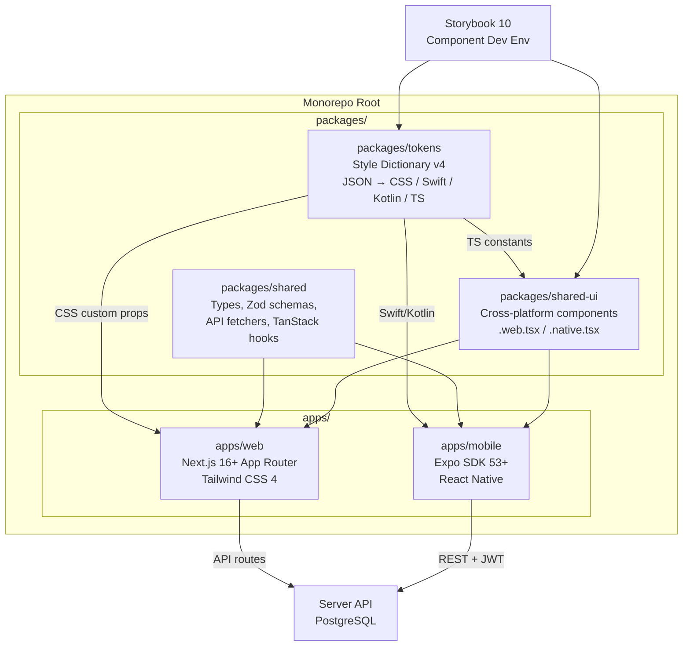
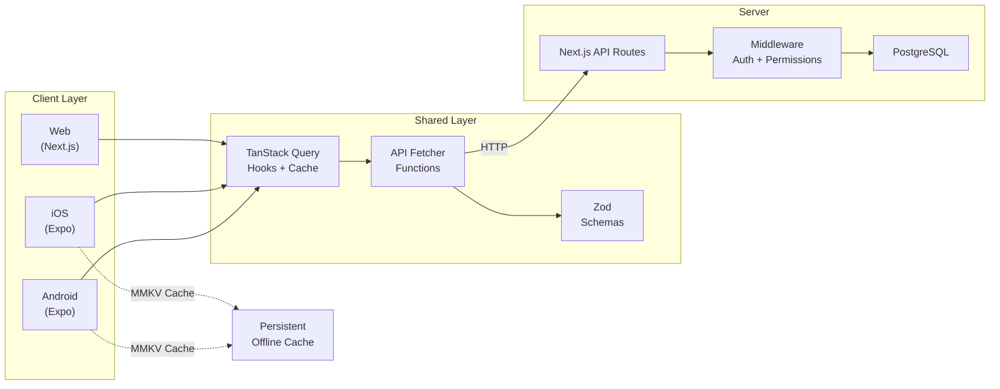
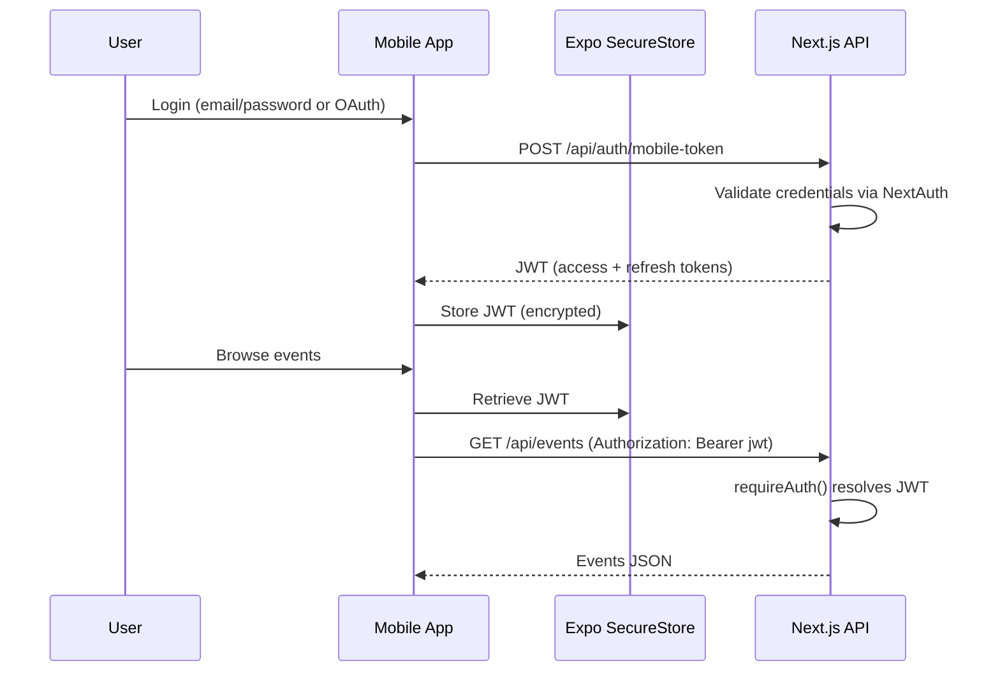
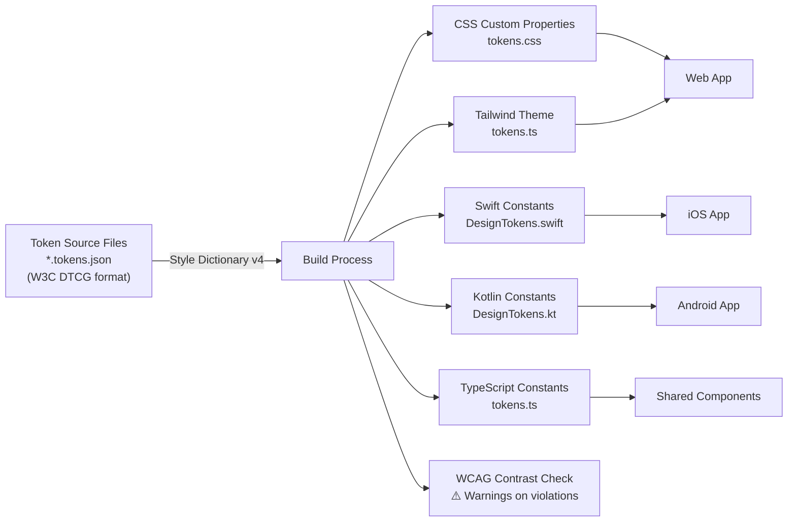
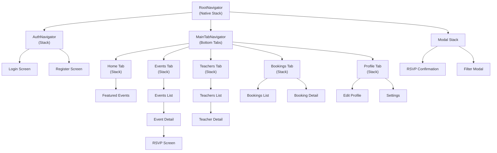
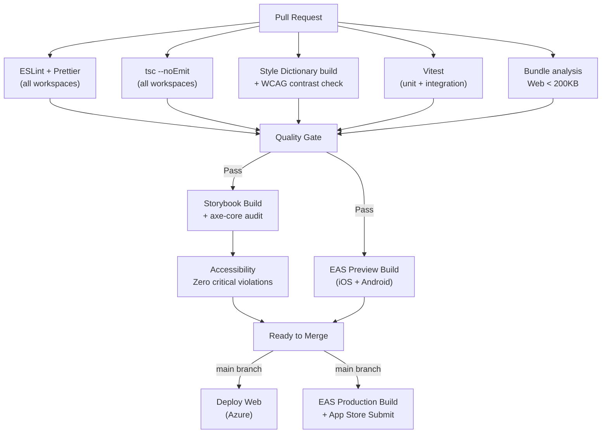

# Implementation Plan: Cross-Platform Hot-Reloadable UI System

**Branch**: `008-cross-platform-ui` | **Date**: 2026-03-17 | **Spec**: [specs/008-cross-platform-ui/spec.md](spec.md)
**Input**: Feature specification from `specs/008-cross-platform-ui/spec.md`

## Summary

Transform the existing Next.js single-app repository into a monorepo with shared packages, introduce a Style Dictionary design token pipeline compiling to web/iOS/Android outputs, build a shared component library with platform-specific rendering adapters, scaffold an Expo + React Native mobile app for iOS and Android, integrate Storybook 10 (`@storybook/react-vite`) for component development, add TanStack Query for unified data fetching with offline support, define a UI Expert Agent via `.agent.md`, and extend CI/CD for mobile builds, accessibility audits, and cross-platform performance budgets.

## Technical Context

**Language/Version**: TypeScript 5.9 (strict mode)
**Primary Dependencies**: Next.js 16+ (App Router), React 19, Tailwind CSS 4, Zod 4, Expo SDK 53+ (React Native), Style Dictionary v4, Storybook 10, TanStack Query v5, React Navigation v7, MMKV (mobile persistence)
**Storage**: PostgreSQL (production), PGlite (test isolation) — no new database tables
**Testing**: Vitest (unit/integration), Playwright (web E2E), Detox or Maestro (mobile E2E), `@storybook/addon-a11y` (axe-core), `react-native-testing-library`
**Target Platform**: Azure (web), App Store (iOS), Play Store (Android), EAS Build (CI)
**Project Type**: Monorepo — `apps/web` (Next.js), `apps/mobile` (Expo), `packages/shared` (logic + types + hooks), `packages/shared-ui` (cross-platform components), `packages/tokens` (Style Dictionary)
**Performance Goals**: Web: LCP < 2.5s, TTI < 3.5s, bundle < 200KB. Mobile: TTI < 3s mid-range, 60fps scroll, binary <50MB iOS / <30MB Android
**Constraints**: No new DB tables. Mobile accesses existing API routes. 80%+ shared code target. WCAG 2.1 AA across all platforms. Constitution VII (Simplicity) — no premature abstractions.
**Scale/Scope**: Multi-city AcroYoga platform; web + iOS + Android; shared component catalogue; UI agent for design assistance

## Constitution Check

*GATE: Must pass before Phase 0 research. Re-check after Phase 1 design.*

| Principle | Status | Notes |
|-----------|--------|-------|
| I. API-First Design | ✅ PASS | Mobile apps consume existing versioned REST API routes. New `/api/auth/mobile-token` endpoint follows API-first pattern. Response shapes defined in `packages/shared/types/`. Error responses use shared `@/lib/errors` helpers. |
| II. Test-First Development | ✅ PASS | Shared packages have Vitest unit tests. Web E2E with Playwright. Mobile E2E with Detox/Maestro. Storybook a11y addon for component-level accessibility. Coverage thresholds maintained. |
| III. Privacy & Data Protection | ✅ PASS | Mobile apps go through existing API endpoints — PII filtering already in place. EXIF stripping applied in existing media pipeline (FR-026). Mobile image uploads go through same API path. |
| IV. Server-Side Authority | ✅ PASS | All business logic remains server-side. Mobile is a thin client consuming API. Zod schemas shared but validation enforced server-side. No direct DB access from mobile. |
| V. UX Consistency | ✅ PASS | Single-source design tokens enforce consistency across platforms. WCAG 2.1 AA enforced via axe-core (web), VoiceOver/TalkBack testing (mobile). 44×44pt touch targets. Mobile-first responsive patterns. |
| VI. Performance Budget | ✅ PASS | Web: 200KB bundle limit preserved. Mobile: 3s TTI, 60fps scroll, binary size budgets. `@next/bundle-analyzer` + EAS Build size checks in CI. No N+1 queries (existing API). |
| VII. Simplicity | ✅ PASS | npm workspaces (no Turborepo/Nx yet). Platform-specific file extensions (`.web.tsx`/`.native.tsx`) over runtime checks. No React Native Web (bundle too large). No wrapper abstractions. |
| VIII. Internationalisation | ✅ PASS | Mobile reuses existing i18n infrastructure via shared package. `Intl.DateTimeFormat`/`Intl.NumberFormat` work in React Native. CI i18n lint extended to mobile. |
| IX. Scoped Permissions | ✅ PASS | Mobile calls same API endpoints with same `withPermission()` middleware. JWT carries same user identity. No permission bypass possible. |
| X. Notification Architecture | ✅ PASS | Push notifications for mobile are a future extension. Current async notification queue remains unchanged. Mobile reads notification state via API. |
| XI. Resource Ownership | ✅ PASS | All mutations go through existing API with ownership checks. Mobile cannot bypass ownership verification. |
| XII. Financial Integrity | ✅ PASS | Stripe payments remain web-only initially (mobile payment requires in-app purchase review). Mobile shows event prices from server. No client-side price computation. |
| QG-5: Bundle Size | ✅ PASS | Monorepo restructure validates web bundle stays <200KB. Tree-shaking keeps mobile-only deps out of web bundle. |
| QG-6: Accessibility | ✅ PASS | axe-core on Storybook static build. ESLint `accessibilityLabel` rules for RN. VoiceOver/TalkBack manual audit per release. |
| QG-9: i18n Compliance | ✅ PASS | CI lint covers `apps/web` and `packages/shared-ui` for raw string literals. |
| QG-11: Auth Consistency | ✅ PASS | Web: `getServerSession()`/`requireAuth()`. Mobile: JWT from `/api/auth/mobile-token` validated server-side. No client-injectable headers for auth. |

**Gate result: PASS — no violations. Proceed to Phase 0.**

---

## Architecture Overview



### Data Flow Architecture



### Mobile Authentication Flow



### Design Token Pipeline



---

## Project Structure

### Documentation (this feature)

```text
specs/008-cross-platform-ui/
├── plan.md              # This file
├── research.md          # Phase 0 — technology decisions & research
├── data-model.md        # Phase 1 — token schemas, component registry schemas
├── quickstart.md        # Phase 1 — developer onboarding
├── contracts/           # Phase 1 — public interfaces
│   └── README.md
└── tasks.md             # Phase 2 (created by /speckit.tasks)
```

### Source Code — Monorepo Structure (target state)

```text
acroyoga-community/                     # Repository root
├── package.json                        # Root workspace config
├── tsconfig.base.json                  # Shared TS config
├── .agent.md                           # UI Expert Agent definition
├── vitest.config.ts                    # Root vitest config
│
├── apps/
│   ├── web/                            # Next.js 16+ (migrated from src/)
│   │   ├── package.json
│   │   ├── next.config.js
│   │   ├── tsconfig.json               # Extends ../../tsconfig.base.json
│   │   ├── tailwind.config.ts          # Consumes tokens via tokens.ts
│   │   ├── postcss.config.mjs
│   │   ├── .storybook/                 # Storybook config
│   │   │   ├── main.ts
│   │   │   └── preview.ts
│   │   ├── src/
│   │   │   ├── app/                    # Next.js App Router (existing pages)
│   │   │   ├── components/             # Web-specific components
│   │   │   ├── lib/                    # Web-specific service layer
│   │   │   ├── db/                     # Database migrations + seeds
│   │   │   └── middleware.ts
│   │   └── tests/
│   │       ├── integration/
│   │       └── e2e/
│   │
│   └── mobile/                         # Expo + React Native
│       ├── package.json
│       ├── app.json                    # Expo config
│       ├── tsconfig.json               # Extends ../../tsconfig.base.json
│       ├── eas.json                    # EAS Build config
│       ├── babel.config.js             # Expo + module-resolver
│       ├── metro.config.js             # Metro bundler (workspace support)
│       ├── app/                        # Expo Router / screens
│       │   ├── (tabs)/                 # Tab navigator
│       │   │   ├── index.tsx           # Home
│       │   │   ├── events.tsx          # Events list
│       │   │   ├── teachers.tsx        # Teachers list
│       │   │   ├── bookings.tsx        # My bookings
│       │   │   └── profile.tsx         # Profile
│       │   ├── events/
│       │   │   └── [id].tsx            # Event detail
│       │   ├── settings.tsx
│       │   └── _layout.tsx             # Root layout
│       ├── components/                 # Mobile-specific components
│       ├── lib/
│       │   ├── auth.ts                 # JWT + SecureStore
│       │   ├── api-client.ts           # Axios/fetch with JWT injection
│       │   ├── offline.ts              # MMKV + TanStack persist
│       │   └── connectivity.ts         # NetInfo wrapper
│       └── __tests__/
│
├── packages/
│   ├── shared/                         # Business logic shared across platforms
│   │   ├── package.json
│   │   ├── tsconfig.json
│   │   ├── types/                      # TypeScript interfaces (from src/types/)
│   │   │   ├── events.ts
│   │   │   ├── rsvp.ts
│   │   │   ├── venues.ts
│   │   │   ├── teachers.ts
│   │   │   ├── permissions.ts
│   │   │   └── ...
│   │   ├── schemas/                    # Zod validation schemas
│   │   │   └── ...
│   │   ├── hooks/                      # TanStack Query hooks
│   │   │   ├── useEvents.ts
│   │   │   ├── useEventDetail.ts
│   │   │   ├── useRsvp.ts
│   │   │   ├── useTeachers.ts
│   │   │   ├── useBookings.ts
│   │   │   └── useProfile.ts
│   │   ├── api/                        # API fetcher functions
│   │   │   └── client.ts
│   │   └── utils/                      # Shared utilities
│   │
│   ├── shared-ui/                      # Cross-platform UI components
│   │   ├── package.json
│   │   ├── tsconfig.json
│   │   ├── Button/
│   │   │   ├── Button.tsx              # Shared props + state logic
│   │   │   ├── Button.web.tsx          # Web rendering (Tailwind)
│   │   │   ├── Button.native.tsx       # RN rendering (StyleSheet)
│   │   │   ├── Button.stories.tsx      # Storybook story
│   │   │   └── Button.test.tsx         # Shared logic tests
│   │   ├── EventCard/
│   │   │   ├── EventCard.tsx
│   │   │   ├── EventCard.web.tsx
│   │   │   ├── EventCard.native.tsx
│   │   │   ├── EventCard.stories.tsx
│   │   │   └── EventCard.test.tsx
│   │   ├── Avatar/
│   │   ├── Badge/
│   │   ├── LoadingSpinner/
│   │   ├── OfflineBanner/
│   │   └── ...
│   │
│   └── tokens/                          # Design token pipeline
│       ├── package.json
│       ├── config.ts                    # Style Dictionary v4 config
│       ├── src/                         # W3C DTCG token source files
│       │   ├── color.tokens.json
│       │   ├── spacing.tokens.json
│       │   ├── typography.tokens.json
│       │   ├── shadow.tokens.json
│       │   └── radius.tokens.json
│       ├── transforms/                  # Custom SD transforms
│       │   └── wcag-contrast.ts         # WCAG AA contrast validation
│       └── build/                       # Generated (gitignored)
│           ├── css/tokens.css
│           ├── tailwind/tokens.ts
│           ├── swift/DesignTokens.swift
│           ├── kotlin/DesignTokens.kt
│           └── ts/tokens.ts
│
└── .github/
    └── workflows/
        ├── ci.yml                       # Existing — extended for monorepo
        ├── mobile-preview.yml           # EAS Preview builds on PRs
        └── mobile-release.yml           # EAS Production builds + submit
```

### Structure Rationale

- **`apps/web`**: Existing `src/` directory relocated into `apps/web/src/`. Next.js config, middleware, and tests move with it. All import paths updated.
- **`apps/mobile`**: New Expo app. Uses React Navigation for native navigation. Consumes `packages/shared` for data hooks and `packages/shared-ui` for components.
- **`packages/shared`**: Extracted from `src/types/` and new TanStack Query hooks. Pure TypeScript — no platform dependencies.
- **`packages/shared-ui`**: New cross-platform component library using `.web.tsx`/`.native.tsx` extensions for platform adaptation.
- **`packages/tokens`**: Style Dictionary pipeline. JSON source → multi-platform build outputs.

---

## Cross-Spec Dependencies

| Spec | Dependency Direction | Integration Point |
|------|---------------------|-------------------|
| 001 — Event Discovery | 008 consumes | Mobile app renders events list, event detail, RSVP flow using existing API routes |
| 002 — Community Social | 008 consumes | Mobile app renders social features (follows, threads) if API routes exist |
| 003 — Recurring/Multi-Day | 008 consumes | Event detail renders recurrence info; occurrence expansion via existing API |
| 004 — Permissions | 008 depends on | Auth session for web; JWT endpoint extends 004's auth. `withPermission()` middleware on all API routes. |
| 005 — Teacher Profiles | 008 consumes | Mobile app renders teacher list and profiles via existing API routes |
| 006 — Code Review Fixes | 008 builds on | Error handling patterns, auth consistency fixes (QG-11) assumed complete |
| 007 — Mock Auth | 008 uses in dev | Mock auth available for mobile dev server; mobile JWT endpoint respects mock auth flag |

---

## Component Migration Strategy

### Phase Approach — Extract, Don't Rewrite

Existing components in `src/components/` are NOT rewritten. They are:

1. **Moved** into `apps/web/src/components/` (web-only components stay web-only)
2. **Evaluated** for cross-platform potential
3. **Extracted gradually**: Components that should be shared get a `packages/shared-ui/` counterpart with the shared logic factored out

### Migration Priority

| Component | Current Location | Action | Priority |
|-----------|-----------------|--------|----------|
| NavHeader | `src/components/NavHeader.tsx` | Keep web-only (navigation differs per platform) | P2 |
| Providers | `src/components/Providers.tsx` | Keep web-only (Next.js-specific context) | — |
| Event components | `src/components/events/` | Extract shared logic to `packages/shared-ui/EventCard/` | P0 |
| Dev components | `src/components/dev/` | Keep web-only (dev tooling) | — |

### Shared Component Candidates (Phase 1)

| Component | Shared Logic | Web Adapter | Native Adapter |
|-----------|-------------|-------------|----------------|
| EventCard | Props, state, date formatting | Tailwind + `<div>` | `View` + `Text` + StyleSheet |
| Button | Variants, disabled state, loading | Tailwind + `<button>` | `Pressable` + StyleSheet |
| Badge | Label, colour mapping | Tailwind + `<span>` | `View` + `Text` |
| Avatar | Initials fallback, size variants | `` + Tailwind | `Image` + StyleSheet |
| LoadingSpinner | Animated state | CSS animation | `Animated.View` |
| OfflineBanner | Connectivity state | CSS banner | `View` + `Text` banner |
| EmptyState | Illustration + message | HTML | RN views |

---

## Storybook Integration Plan

### Configuration

```text
apps/web/.storybook/
├── main.ts          # Storybook config — framework: @storybook/react-vite
└── preview.ts       # Global decorators — import tokens.css, theme toggle
```

**Addons**:
- `@storybook/addon-essentials` — Controls, Viewport, Backgrounds, Actions, Docs
- `@storybook/addon-a11y` — axe-core accessibility audit per component
- `@storybook/addon-themes` — Light/dark theme toggle in toolbar

**Story co-location**: Every `packages/shared-ui/` component gets a `.stories.tsx` file. Storybook loads stories from both `apps/web/src/components/` (web-only) and `packages/shared-ui/` (shared, web rendering).

**Token integration**: `preview.ts` imports `packages/tokens/build/css/tokens.css` globally. Theme switching toggles `[data-theme="dark"]` class.

---

## TanStack Query Architecture

### Shared Hook Pattern

```text
packages/shared/hooks/useEvents.ts
  → Calls packages/shared/api/client.ts
  → Uses query key: ['events', filters]
  → Returns { data, isLoading, error, refetch }

packages/shared/hooks/useRsvp.ts
  → useMutation with optimistic update
  → Invalidates ['events', eventId] on success
```

### Offline Strategy (Mobile)

| Concern | Solution |
|---------|----------|
| Cache persistence | `@tanstack/query-persist-client-core` + `react-native-mmkv` adapter |
| Stale data display | `gcTime: Infinity`, `staleTime: 5min` — shows cached data immediately |
| Background sync | `refetchOnReconnect: true` via `onlineManager` + `@react-native-community/netinfo` |
| Offline mutations | `useMutation` + mutation cache persistence + exponential backoff retry |
| Connectivity UI | `OfflineBanner` component using `useOnlineStatus()` hook |

### Web vs Mobile QueryClient Config

| Setting | Web | Mobile |
|---------|-----|--------|
| `staleTime` | 30s | 5min (reduce network on mobile) |
| `gcTime` | 5min | Infinity (keep offline cache) |
| Persistence | None (SSR hydration) | MMKV via `persistQueryClient` |
| Retry | 3 attempts | 3 attempts + offline queue |

---

## React Navigation — Mobile Navigation Structure



### Navigation Decisions

| Concern | Decision | Rationale |
|---------|----------|-----------|
| Stack type | Native Stack (`@react-navigation/native-stack`) | True native transitions, best performance |
| Tab bar | Bottom Tabs (`@react-navigation/bottom-tabs`) | iOS/Android standard; 5 tabs max |
| Deep linking | Expo linking config + React Navigation | Universal links for event sharing |
| Back button (Android) | Automatic via React Navigation | No custom handling needed |
| TypeScript types | Centralized `NavigationTypes.ts` | Type-safe `navigation.navigate()` calls |

---

## CI/CD Extensions

### Updated CI Pipeline



### GitHub Actions — New Workflows

| Workflow | Trigger | Actions |
|----------|---------|---------|
| `ci.yml` (extended) | PR to main | Lint, typecheck, test, bundle check, token build, Storybook build + a11y |
| `mobile-preview.yml` | PR with `apps/mobile/` or `packages/` changes | EAS Build preview profile → internal distribution |
| `mobile-release.yml` | Push to main + release tag | EAS Build production → EAS Submit (TestFlight + Play Internal) |

---

## UI Expert Agent Definition

### `.agent.md` Location and Scope

The UI Expert Agent is defined at the repository root as `.agent.md` (or within a `.github/agents/` directory). It provides:

1. **Design system knowledge**: All token names, semantic meanings, and usage rules
2. **Component library API**: Props, variants, and composition patterns for all shared components
3. **Tailwind CSS 4 conventions**: Utility patterns, breakpoints, responsive strategy
4. **WCAG 2.1 AA rules**: Contrast ratios, focus management, ARIA patterns, touch targets
5. **Mobile-first patterns**: Responsive breakpoints, platform-specific adaptations

### Agent Capabilities

| Capability | Description |
|------------|-------------|
| Generate component | Creates new shared component with `.tsx`, `.web.tsx`, `.native.tsx`, `.stories.tsx`, `.test.tsx` |
| Review UI code | Identifies hardcoded values, missing tokens, a11y issues, responsive gaps |
| Suggest improvements | Proposes token usage, layout optimizations, accessibility fixes |
| Explain tokens | Describes available token values and semantic meanings |
| Platform adaptation | Guides developers on `.web.tsx` vs `.native.tsx` patterns |

---

## Testing Strategy

### Per-Layer Testing

| Layer | Tool | Type | Coverage Target |
|-------|------|------|-----------------|
| `packages/shared` | Vitest | Unit | ≥ 80% line coverage |
| `packages/shared-ui` (logic) | Vitest | Unit | ≥ 80% line coverage |
| `packages/shared-ui` (rendering) | React Testing Library + react-native-testing-library | Component | All variants + a11y |
| `packages/tokens` | Vitest | Unit | Token build outputs correct |
| `apps/web` | Vitest + PGlite | Integration | ≥ 60% overall (existing) |
| `apps/web` | Playwright | E2E | All P0 user flows |
| `apps/web` | Storybook + axe-core | Accessibility | Zero critical violations |
| `apps/mobile` | Detox or Maestro | E2E | Events browse → RSVP flow |
| `apps/mobile` | react-native-testing-library | Component | Screen rendering + navigation |

### Accessibility Testing Matrix

| Platform | Automated | Manual |
|----------|-----------|--------|
| Web | axe-core in Storybook + CI, eslint-plugin-jsx-a11y | Keyboard navigation audit |
| iOS | ESLint `accessibilityLabel` rule | VoiceOver walkthrough per release |
| Android | ESLint `accessibilityLabel` rule | TalkBack walkthrough per release |
| Cross-platform | `react-native-testing-library` a11y matchers | Dynamic Type / font scaling test |

### Performance Testing

| Platform | Tool | CI Integration |
|----------|------|---------------|
| Web | Lighthouse CI, `@next/bundle-analyzer` | Fail on >200KB bundle, LCP >2.5s |
| iOS | Xcode Instruments, `react-native-performance` | EAS Build logs binary size |
| Android | Android Profiler, `adb shell dumpsys gfxinfo` | EAS Build logs binary size |

---

## Monorepo Migration Plan

### Step-by-Step — Minimal Disruption

The monorepo restructure is the riskiest step. It must be done incrementally to avoid a single massive PR.

**Step 1 — npm workspaces setup** (non-breaking):
- Add `workspaces` field to root `package.json`
- Create `packages/shared/`, `packages/tokens/`, `packages/shared-ui/` as empty packages
- Create `apps/` directory structure
- Root `package.json` points to `["apps/*", "packages/*"]`

**Step 2 — Move web app** (single atomic commit):
- Move `src/`, `tests/`, `next.config.js`, `postcss.config.mjs`, `tsconfig.json`, `vitest.config.ts` into `apps/web/`
- Create `apps/web/package.json` with web-specific deps
- Update all import paths (or use `tsconfig` path aliases)
- Verify `npm run dev`, `npm run build`, `npm run test` still pass from root via workspace commands

**Step 3 — Extract shared types**:
- Copy `src/types/*.ts` into `packages/shared/types/`
- Update `apps/web` imports to reference `@acroyoga/shared`
- Verify type-check passes

**Step 4 — Build token pipeline**:
- Populate `packages/tokens/` with Style Dictionary config and token source files
- Run first build, verify CSS/TS/Swift/Kotlin outputs
- Integrate token CSS into `apps/web` Tailwind config

**Step 5 — Scaffold mobile app**:
- Run `npx create-expo-app apps/mobile --template blank-typescript`
- Configure Metro for workspace package resolution
- Add React Navigation, TanStack Query, MMKV

**Step 6 — Extract shared hooks**:
- Create TanStack Query hooks in `packages/shared/hooks/`
- Create API fetcher functions in `packages/shared/api/`
- Wire mobile app to consume shared hooks

**Step 7 — Shared UI components**:
- Implement first shared component (Button) with `.web.tsx`/`.native.tsx`
- Validate renders correctly on web and mobile
- Scale to EventCard, Badge, Avatar, etc.

---

## Performance Budget Enforcement

| Metric | Target | Enforcement |
|--------|--------|-------------|
| Web initial JS bundle | < 200KB compressed | `@next/bundle-analyzer` in CI; fail build |
| Web LCP | < 2.5s on 3G | Lighthouse CI |
| Mobile TTI (iOS) | < 3s mid-range | `react-native-performance` + EAS metrics |
| Mobile TTI (Android) | < 3s mid-range | `react-native-performance` + EAS metrics |
| Mobile binary (iOS) | < 50MB download | EAS Build size report |
| Mobile binary (Android) | < 30MB download | EAS Build size report |
| Scroll FPS (all) | 60fps | Manual audit; Flipper profiling in dev |

---

## Risk Register

| Risk | Likelihood | Impact | Mitigation |
|------|-----------|--------|------------|
| Monorepo migration breaks existing web CI | Medium | High | Step-by-step migration; each step verified with full CI pass before proceeding |
| Metro bundler struggles with workspace packages | Medium | Medium | `metro.config.js` with `watchFolders` and `nodeModulesPaths` pointing to workspace root |
| Web bundle size increases from shared package imports | Medium | High | Tree-shaking verified per PR; `@next/bundle-analyzer` gates in CI |
| React Native New Architecture instability | Low | Medium | Pin Expo SDK version; fallback to old architecture if issues arise |
| Mobile auth (JWT) sync with NextAuth session changes | Medium | Medium | Integration tests verifying JWT ↔ session parity; refresh token rotation |
| Storybook adds build time to CI | Low | Low | Parallel CI jobs; Storybook build only when `packages/shared-ui/` or `apps/web/src/components/` change |
| Device-specific rendering differences | Medium | Medium | Visual regression tests via Chromatic or Percy (web); manual QA per release (mobile) |

---

## Complexity Tracking

No constitution violations detected. No complexity justifications needed.

The following decisions were made to maintain simplicity (Constitution VII):
- **npm workspaces** over Turborepo/Nx — zero additional tooling
- **Platform file extensions** (`.web.tsx`/`.native.tsx`) over React Native Web — avoids 100KB+ bundle bloat
- **No Storybook for React Native** — ecosystem too immature; Expo dev client preview is sufficient
- **No NativeWind** — Tailwind v4 support immature; revisit after stabilisation
- **MMKV over AsyncStorage** — 10x faster, no additional complexity

---

## Post–Phase 1 Constitution Re-Check

| Principle | Status | Notes |
|-----------|--------|-------|
| I. API-First | ✅ PASS | Mobile JWT endpoint follows API-first. All contracts in `packages/shared/types/`. |
| II. Test-First | ✅ PASS | Per-layer testing strategy covers all packages. E2E for web and mobile. |
| III. Privacy | ✅ PASS | Mobile goes through same API; EXIF stripping in existing pipeline. |
| IV. Server-Side Authority | ✅ PASS | All business logic server-side. Zod schemas shared for DX, enforced server-side. |
| V. UX Consistency | ✅ PASS | Token pipeline guarantees cross-platform visual consistency. WCAG enforced. |
| VI. Performance Budget | ✅ PASS | Budgets defined per platform with CI enforcement. |
| VII. Simplicity | ✅ PASS | Minimal tooling additions. No premature abstractions. |
| VIII. Internationalisation | ✅ PASS | Shared i18n via `Intl` APIs. CI lint for raw strings. |
| IX. Scoped Permissions | ✅ PASS | Same `withPermission()` middleware via API. |
| X. Notification | ✅ PASS | Push notifications deferred; current queue unchanged. |
| XI. Resource Ownership | ✅ PASS | All mutations go through API with ownership checks. |
| XII. Financial Integrity | ✅ PASS | Stripe remains web-only; mobile displays server prices. |

**Post–Phase 1 re-check: PASS** — architecture, data model, and contracts align with all principles.

---

## Phase Summary

| Phase | Deliverable | Status |
|-------|-------------|--------|
| Phase 0 | `research.md` — technology decisions, alternatives | ✅ Complete |
| Phase 1 | `data-model.md`, `contracts/`, `quickstart.md` | ✅ Complete |
| Phase 2 | `tasks.md` — implementation tasks (`/speckit.tasks`) | ⏳ Not started |
